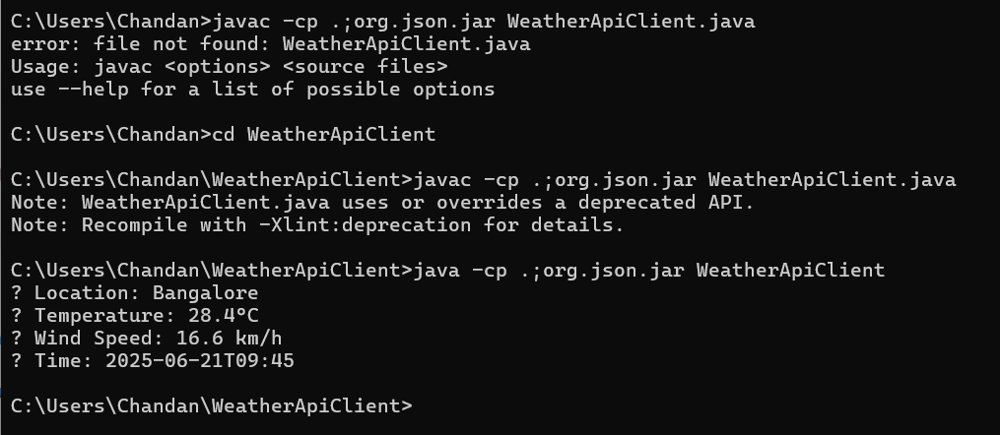

COMPANY: CODETECH IT SOLUTIONS  

NAME: CHANDAN JAIWANT GOUDA

INTERN ID: CT04DF2793 

DOMAIN: JAVA PROGRAMMING  

DURATION: 4 WEEKS  

MENTOR: NEELA SANTHOSH KUMAR 

DESCRIPTION: As part of my Java programming internship at Codetech IT Solutions, under the mentorship of Neela Santhosh, I was assigned Task-2: REST API Client. The objective was to write a Java application that consumes a public REST API and displays the fetched data in a structured format. This task introduced me to network programming in Java and helped me learn about handling HTTP requests and parsing JSON responses programmatically.

For this task, I used BlueJ as my primary development environment. BlueJ is a beginner-friendly, open-source Java IDE that allows easy management of projects and compilation and execution of Java programs. Its integrated terminal window and class structure diagram made it convenient to design, run, and test this Java-based API client.

The program begins by importing necessary Java classes such as java.net.HttpURLConnection, java.net.URL, java.io.BufferedReader, and java.io.InputStreamReader, which handle network connections and input streams from URLs. I selected https://jsonplaceholder.typicode.com/users/1 as a placeholder public REST API for this demonstration. This particular API returns JSON data representing user details, making it ideal for illustrating HTTP GET requests and JSON response handling.

The logic starts by creating a URL object with the desired API endpoint. I then opened an HTTP connection using HttpURLConnection and set the request method to GET. The program reads the response code to confirm a successful connection, and if it returns HTTP_OK (200), it reads the incoming data using a BufferedReader object. Each line of the response is appended to a StringBuffer object to form the full JSON response.

Once the data is completely read, the program displays it directly on the BlueJ terminal window. If any errors occur during the connection, they are caught using a try-catch block, and the stack trace is printed for debugging. Comments have been added at each step to explain the purpose of different code sections for clarity.

For syntax verification and minor improvements, I referred to Oracle’s official Java documentation for classes like HttpURLConnection and BufferedReader. Open-source educational websites such as GeeksforGeeks, W3Schools, and JavaPoint were valuable resources in understanding network programming concepts and JSON handling in Java.

I also made occasional use of ChatGPT as an auxiliary tool to confirm syntax and clarify error messages encountered during compilation. It was useful for resolving specific issues like setting up HTTP request headers or interpreting response codes but was used minimally to retain the integrity of independent program development.

After writing the code, I executed and tested it in BlueJ. The terminal window within BlueJ displayed the HTTP response code and the fetched JSON content accurately. I tested the program with multiple APIs to ensure its adaptability. The project improved my understanding of how Java applications interact with external APIs and handle data parsing over network connections.

Overall, this task enhanced my practical knowledge of HTTP communication in Java and reinforced concepts like stream handling, error management, and API integration. It also boosted my familiarity with using BlueJ for real-world projects and open-source resources for Java programming. The REST API client program developed in this task will serve as a foundation for future projects involving web services and JSON data processing.

OUTPUT :  
