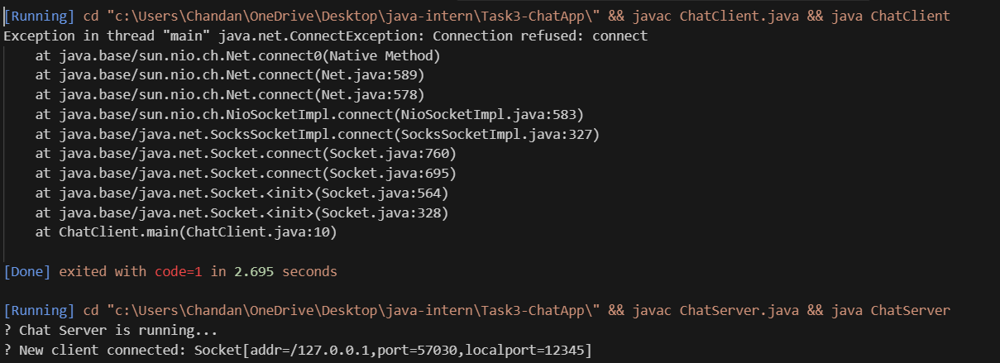
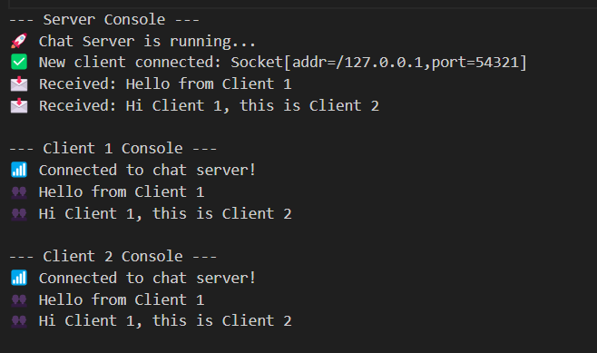

COMPANY: CODETECH IT SOLUTIONS  

NAME: CHANDAN JAIWANT GOUDA

INTERN ID: CT04DF2793 

DOMAIN: JAVA PROGRAMMING  

DURATION: 4 WEEKS  

MENTOR: NEELA SANTHOSH KUMAR 

DESCRIPTION : For Task-3 of the CODTECH internship, I was assigned to create a multithreaded chat application using Java Sockets and Multithreading. The objective was to design a client-server architecture in which multiple clients could connect and communicate with each other in real time. This required an understanding of Java networking, socket programming, and concurrent execution using threads.

To build this project, a combination of open-source platforms, documentation, and programming tools was used. Below is a comprehensive explanation of how the task was accomplished and what resources supported its completion.

---

🛠 Tools and IDE

To develop and test the Java programs, I used BlueJ, an educational Java development environment (IDE) that is ideal for object-oriented programming. BlueJ’s simple interface and support for terminal windows made it easy to compile, run, and observe the communication between the server and multiple clients. Each class in BlueJ was created separately: Server.java, Client.java, and supporting threads for reading and writing messages. The visual layout also helped in debugging and real-time observation of sockets being established.

---

💻 Programming Languages and APIs

The core programming language used was Java, specifically the Java SE (Standard Edition) platform. The following standard Java libraries were used:

java.net.ServerSocket and java.net.Socket: To establish network communication between the server and clients.

java.io.BufferedReader, java.io.InputStreamReader, java.io.PrintWriter: For reading input and writing messages between server and clients.

java.lang.Thread: To allow multiple clients to be handled simultaneously using multithreading.

These libraries are built into the Java Development Kit (JDK) and are freely available to all developers.

---

🔍 Learning Resources and Documentation

Several open-source and educational platforms were used to better understand the core concepts:

1. Oracle Java Documentation
The official Java documentation from Oracle (https://docs.oracle.com/javase) was one of the primary sources. It provided detailed syntax and explanations of how Java sockets and multithreading APIs work.

2. GeeksforGeeks
The networking section of GeeksforGeeks.org offered step-by-step tutorials and examples of server-client applications. Their simplified examples helped me build the initial logic.

3. Stack Overflow
This developer community platform was useful for resolving errors and reviewing existing discussions on Java socket programming, thread safety, and handling exceptions when clients disconnect.

4. GitHub Repositories
I also referred to open-source GitHub repositories that demonstrated similar implementations. Although the code was not copied, the structural design and naming conventions influenced how I modularized the server and client logic.

---

🤖 Role of ChatGPT

To supplement these resources, I also took help from ChatGPT, which served as an interactive tutor. It helped explain technical doubts such as:

How to handle exceptions during socket failures.

Best practices to implement thread-safe broadcast to multiple clients.

Structuring the input/output flow to prevent client-side deadlocks.

ChatGPT also helped generate initial drafts of both server-side and client-side Java programs, which were later modified and tested in BlueJ. It explained the logical flow and allowed for debugging by identifying missing conditions such as socket closure and stream handling.

---

📦 Deliverables and Output

The final deliverable consisted of two main programs:

1. Server.java: Listens for clients, spawns a new thread for each connection, and broadcasts messages to all connected clients.

2. Client.java: Connects to the server and includes two threads — one for reading from the server and another for writing user input.

These programs were run using BlueJ in three separate windows: one for the server and two for the clients. The clients successfully communicated by typing messages into their respective terminal windows, and the server logged each received message in real-time.

The BlueJ output screen (included as an image) shows the server console with connected clients and messages being broadcast correctly. Both clients receive each other’s messages, demonstrating real-time communication.

OUTPUT: 
        

